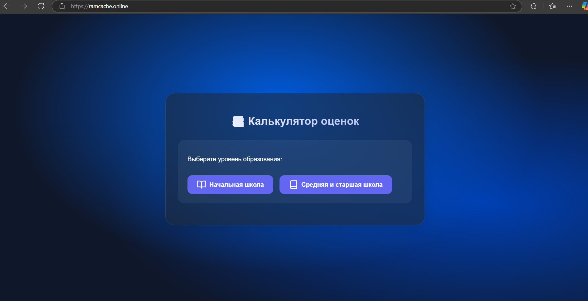
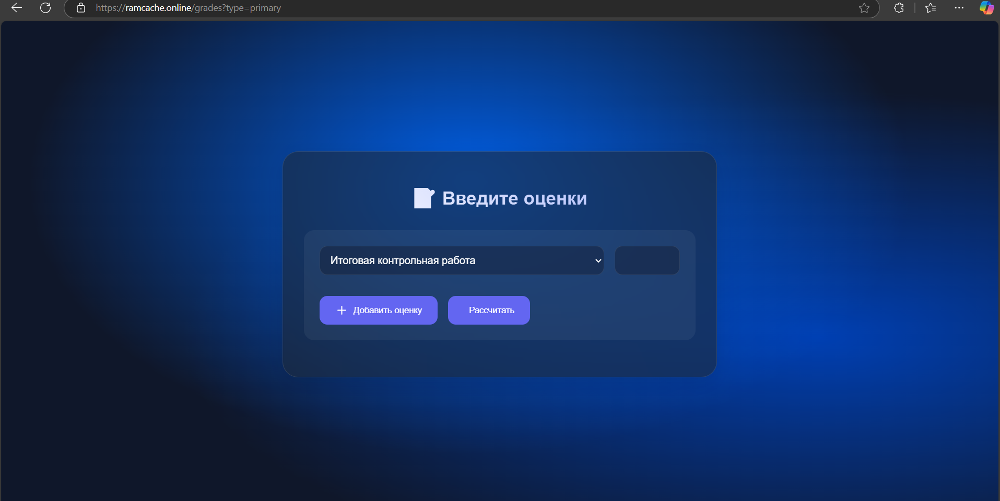
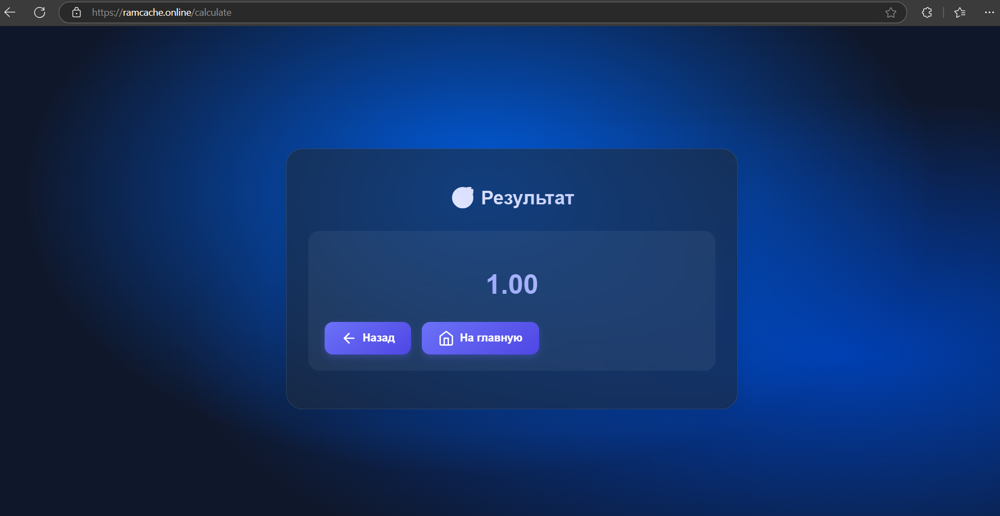

# EduScoreCalc 🎓

**EduScoreCalc** — это современный и удобный калькулятор средневзвешенных оценок для школьников. Проект разработан с использованием Go для бэкенда и HTML/CSS/JavaScript для фронтенда. Поддерживает расчёт оценок для начальной, средней и старшей школы с учётом весов различных типов работ.

## Особенности ✨
- 🌐 Адаптивный и современный дизайн.
- 📱 Поддержка мобильных устройств.
- 🎨 Стеклянный эффект и анимации.
- 📊 Учёт весов различных типов работ.
- 🧮 Точный расчёт средневзвешенного балла.

## Технологии 🛠️
- **Backend**: Go (Golang)
- **Frontend**: HTML, CSS, JavaScript
- **Стили**: Современный CSS с градиентами и анимациями
- **Иконки**: Feather Icons

## Как использовать 🚀
1. Клонируйте репозиторий:
   ```bash
   git clone https://github.com/Ramcache/EduScoreCalc.git
   ```
2. Перейдите в директорию проекта:
   ```bash
   cd EduScoreCalc
   ```
3. Запустите сервер:
   ```bash
   go run main.go
   ```
4. Откройте браузер и перейдите по адресу:
   ```
   https:/ramcache.online/
   ```

## Скриншоты 📸




---

Разработано с ❤️ для школьников и учителей.
```
